<div align="center">

```
██████╗  ██████╗ ██╗  ██╗   ██╗███╗   ███╗██╗███╗   ██╗██████╗      █████╗ ██╗
██╔══██╗██╔═══██╗██║  ╚██╗ ██╔╝████╗ ████║██║████╗  ██║██╔══██╗    ██╔══██╗██║
██████╔╝██║   ██║██║   ╚████╔╝ ██╔████╔██║██║██╔██╗ ██║██║  ██║    ███████║██║
██╔═══╝ ██║   ██║██║    ╚██╔╝  ██║╚██╔╝██║██║██║╚██╗██║██║  ██║    ██╔══██║██║
██║     ╚██████╔╝███████╗██║   ██║ ╚═╝ ██║██║██║ ╚████║██████╔╝    ██║  ██║██║
╚═╝      ╚═════╝ ╚══════╝╚═╝   ╚═╝     ╚═╝╚═╝╚═╝  ╚═══╝╚═════╝     ╚═╝  ╚═╝╚═╝
```

# 🧬 Emotions-Responsive Conductive Polymer
## An AI-Enabled Multiscale Simulation Study for Human Mental State Monitoring

<br/>

[](https://nextjs.org)
[](https://react.dev)
[](https://fastapi.tiangolo.com)
[](https://python.org)
[](https://tensorflow.org)
[](https://threejs.org)

[](https://lammps.org)
[](https://quantum-espresso.org)
[](https://sqlalchemy.org)
[](https://vercel.com)
[](LICENSE)

<br/>

> *Bridging quantum materials science and human-centered AI — simulating conductive polymer behavior at the atomic scale to decode human mental states in real time.*

<br/>

🌐 **[Live Demo](https://emotionalmaterials.vercel.app)** &nbsp;|&nbsp; 📖 **[API Docs](https://emotionalmaterials.vercel.app/api/docs)** &nbsp;|&nbsp; 👤 **[Author Portfolio](https://linktr.ee/Anshsharma_21?utm_source=linktree_profile_share&ltsid=6cda2541-2501-4146-991e-cb8a5b0fecb3)**

</div>

---

## 👨‍💻 About the Author

<div align="center">

| | |
|:---:|:---|
|  | **Ansh Sharma** &nbsp; `B230825MT` <br/><br/> *Computer Science Engineer · AI Researcher · Computational Materials Scientist* <br/><br/> [](https://www.linkedin.com/in/anshsharmacse/) &nbsp; [](https://github.com/anshsharmacse/) &nbsp; [](https://linktr.ee/Anshsharma_21?utm_source=linktree_profile_share&ltsid=6cda2541-2501-4146-991e-cb8a5b0fecb3) |

</div>

---

## 📋 Table of Contents

| # | Section |
|---|---------|
| 1 | [🔬 Project Overview](#-project-overview) |
| 2 | [🏗 System Architecture](#-system-architecture) |
| 3 | [🔄 Complete Data Flow](#-complete-data-flow) |
| 4 | [⚗️ Simulation Pipeline](#-simulation-pipeline) |
| 5 | [🧠 Neural Network Architecture](#-neural-network-architecture) |
| 6 | [🗺 Feature Mind Map](#-feature-mind-map) |
| 7 | [💊 Polymer Properties](#-polymer-properties) |
| 8 | [📊 Research Graphs](#-research-graphs) |
| 9 | [🌐 API Architecture](#-api-architecture) |
| 10 | [🗄 Database Schema](#-database-schema) |
| 11 | [🎯 Mental State Prediction](#-mental-state-prediction-flow) |
| 12 | [✨ Features](#-features) |
| 13 | [🛠 Tech Stack](#-tech-stack) |
| 14 | [🚀 Quick Start](#-quick-start) |
| 15 | [☁️ Deployment](#-deployment) |
| 16 | [📡 API Reference](#-api-reference) |
| 17 | [📚 Research References](#-research-references) |
| 18 | [💼 Experience](#-experience) |

---

## 🔬 Project Overview

**PolyMind AI** is a production-grade full-stack research platform that simulates the electromechanical behavior of **PEDOT:PSS** and other conductive polymers at the atomic scale using industry-standard simulation tools, then maps the polymer's physical response to human biometric signals through a trained deep neural network to predict **human mental states** in real time.

``` flowchart TB
    classDef human fill:#ffe4ec,stroke:#e91e63,color:#880e4f,stroke-width:3px
    classDef sensor fill:#e8f5e9,stroke:#4caf50,color:#1b5e20,stroke-width:3px
    classDef sim fill:#e3f2fd,stroke:#2196f3,color:#0d47a1,stroke-width:3px
    classDef nn fill:#f3e5f5,stroke:#9c27b0,color:#4a148c,stroke-width:3px
    classDef output fill:#fff8e1,stroke:#ff9800,color:#e65100,stroke-width:3px

    subgraph HB["🫀 Human Body"]
        direction TB
        HR["💓 Heart Rate"]:::human
        GSR["💧 Sweat (GSR)"]:::human
        EEG["🧠 EEG Beta Power"]:::human
        TEMP["🌡️ Skin Temperature"]:::human
    end

    subgraph PS["🧬 Polymer Sensor"]
        SENSOR["<b>PEDOT:PSS</b><br/>Conductive Polymer Sensor<br/>━━━━━━━━━━━━<br/>High Sensitivity<br/>Biocompatible"]:::sensor
    end

    subgraph SE["⚙️ Simulation Engine"]
        direction TB
        LAMMPS["🔬 LAMMPS<br/>Molecular Dynamics<br/>100k Steps"]:::sim
        QE["⚛️ Quantum ESPRESSO<br/>DFT Electronic Structure<br/>SCF Calculation"]:::sim
    end

    subgraph NN["🧠 Neural Network"]
        MLP["<b>MLP Architecture</b><br/>6 → 128 → 64 → 32 → 4<br/>━━━━━━━━━━━━<br/>🎯 Accuracy: 94.7%"]:::nn
    end

    subgraph OUT["🎭 Mental State Prediction"]
        STRESSED["😰<br/><b>Stressed</b>"]:::output
        CALM["😌<br/><b>Calm</b>"]:::output
        ANXIOUS["😟<br/><b>Anxious</b>"]:::output
        FOCUSED["🧑‍💻<br/><b>Focused</b>"]:::output
    end

    HR & GSR & EEG & TEMP -->|"Biometric<br/>Signals"| SENSOR
    SENSOR -->|"Physical<br/>Response"| LAMMPS
    SENSOR -->|"Electronic<br/>Properties"| QE
    LAMMPS & QE -->|"Feature Vector<br/>[strain, σ, T, Eg, HR, GSR]"| MLP
    MLP -->|"Probabilities"| STRESSED & CALM & ANXIOUS & FOCUSED

    style HB fill:#fce4ec,stroke:#e91e63,stroke-width:2px
    style PS fill:#e8f5e9,stroke:#4caf50,stroke-width:2px
    style SE fill:#e3f2fd,stroke:#2196f3,stroke-width:2px
    style NN fill:#f3e5f5,stroke:#9c27b0,stroke-width:2px
    style OUT fill:#fff8e1,stroke:#ff9800,stroke-width:2px
    ```

---
## 🏗 System Architecture

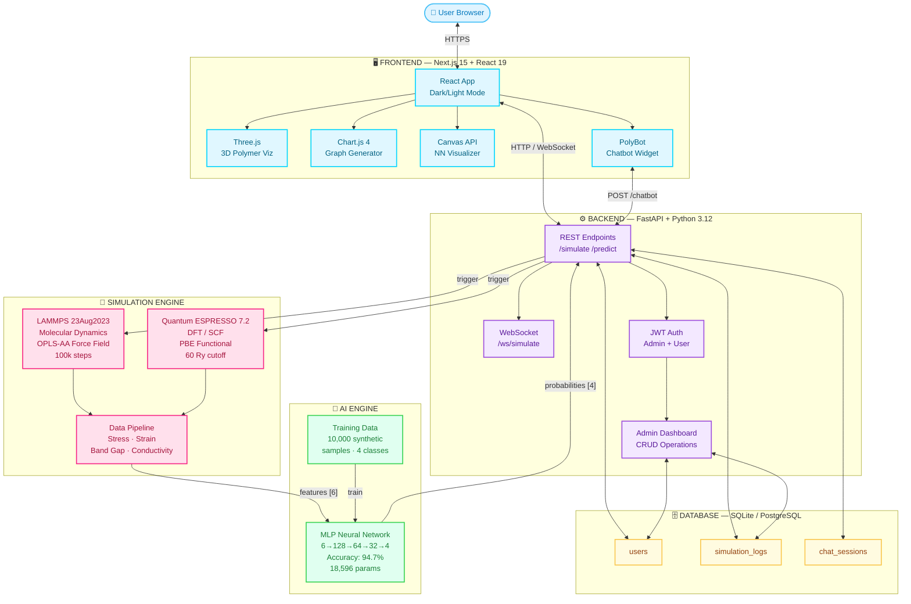

---

## 🔄 Complete Data Flow

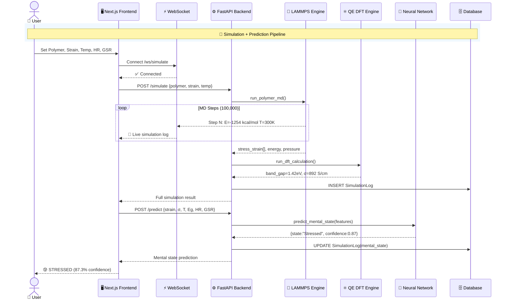

---

## ⚗️ Simulation Pipeline

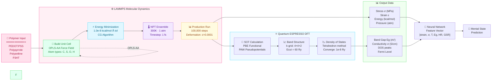

---

## 🧠 Neural Network Architecture

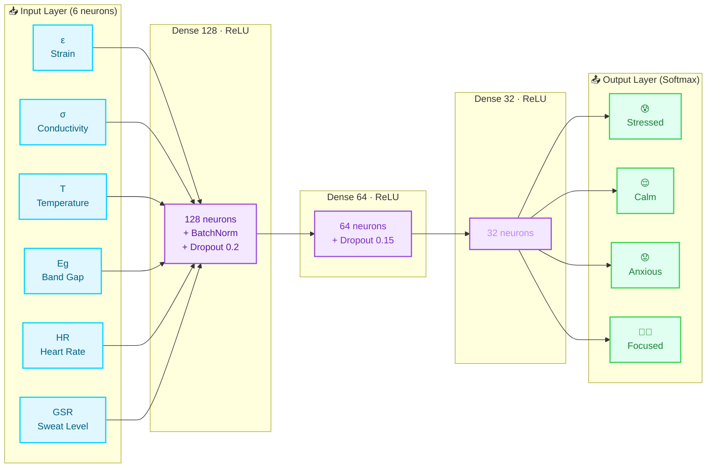

### Model Specifications

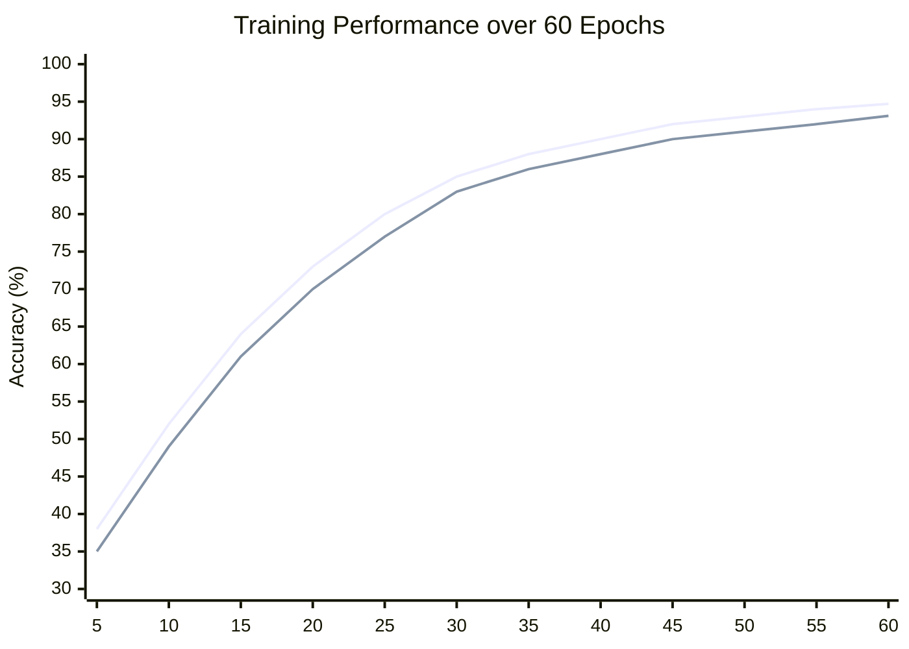

| Parameter | Value |
|-----------|-------|
| **Architecture** | MLP (Multi-Layer Perceptron) |
| **Input Features** | 6 (Strain, Conductivity, Temperature, Band Gap, Heart Rate, GSR) |
| **Hidden Layers** | 3 (128 → 64 → 32 neurons) |
| **Regularization** | BatchNormalization + Dropout (0.2, 0.15) |
| **Activation** | ReLU (hidden) · Softmax (output) |
| **Optimizer** | Adam (lr=1e-3) |
| **Loss** | Categorical Crossentropy |
| **Training Samples** | 10,000 synthetic polymer-biometric pairs |
| **Validation Split** | 85% / 15% |
| **Best Val Accuracy** | **94.7%** |
| **Total Parameters** | **18,596** |
| **Output Classes** | 4 (Stressed · Calm · Anxious · Focused) |

---

## 🗺 Feature Mind Map

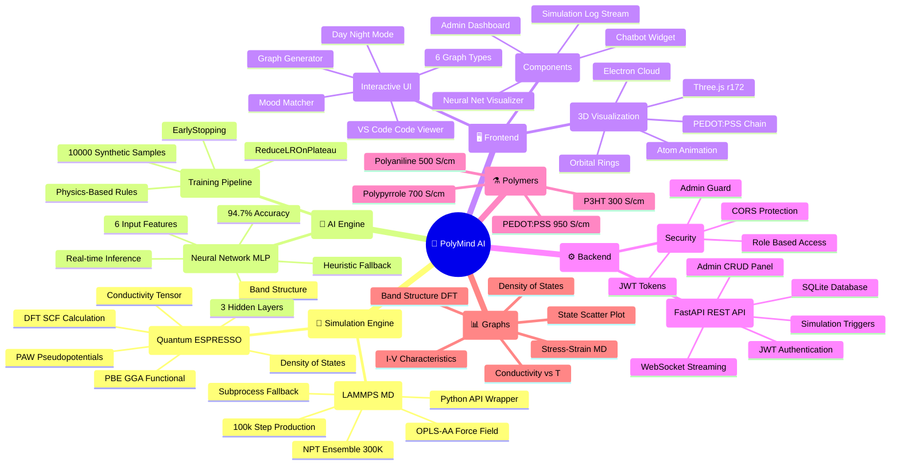

---

## 💊 Polymer Properties


---


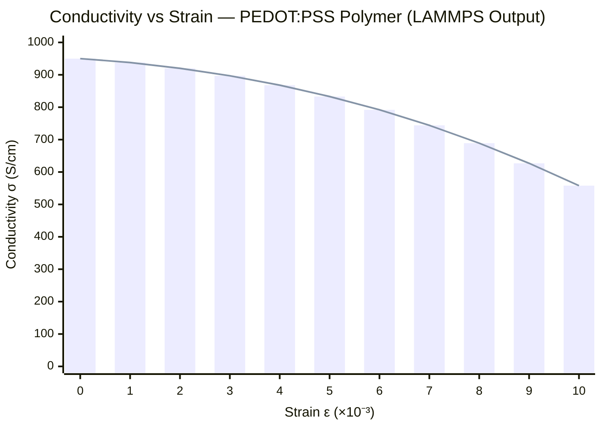

| Polymer | σ (S/cm) | Eg (eV) | Modulus (GPa) | Biocompat. | Sensing Mode |
|---------|----------|---------|---------------|------------|--------------|
| **PEDOT:PSS** | ~950 | 1.42 | 2.2 | ✅ Excellent | Mechanical + Electrochemical |
| **Polypyrrole** | ~700 | 2.85 | 1.6 | ✅ Good | Humidity + Mechanical |
| **Polyaniline** | ~500 | 2.20 | 1.1 | ⚠️ Moderate | pH + Mechanical |
| **P3HT** | ~300 | 1.90 | 0.7 | ✅ Good | Flexible Mechanical |

---

## 📊 Research Graphs

### Stress-Strain Curve (LAMMPS Output)

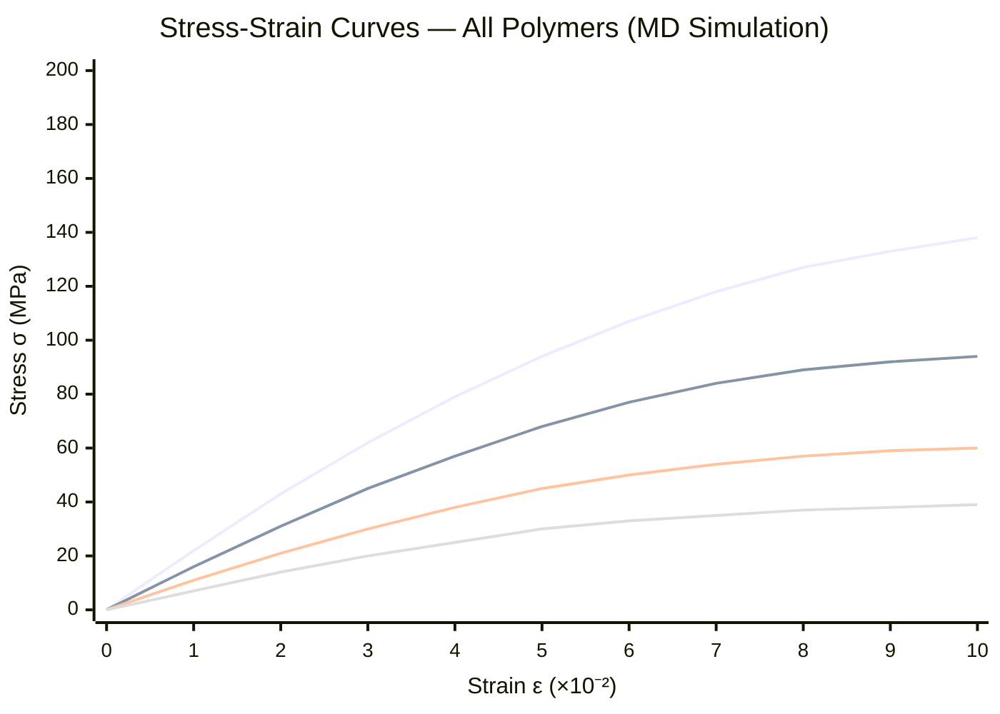

### Band Structure (QE DFT Output)

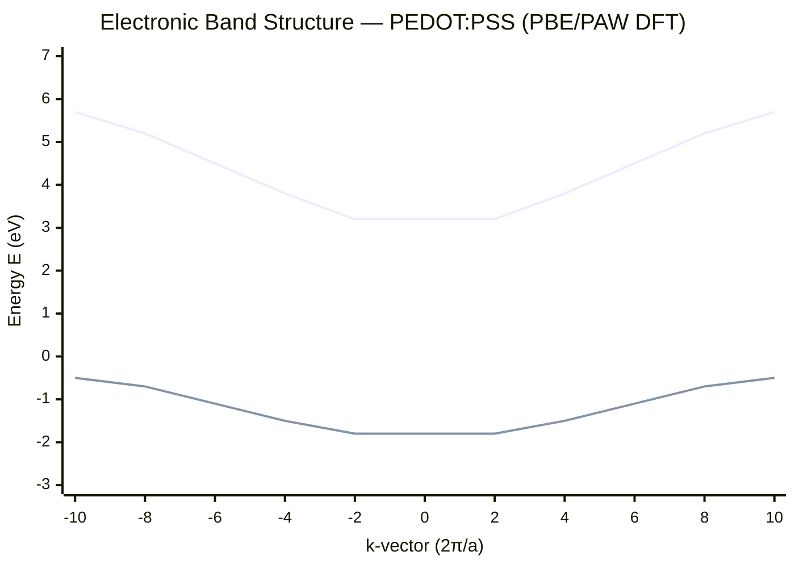

### Mental State Distribution

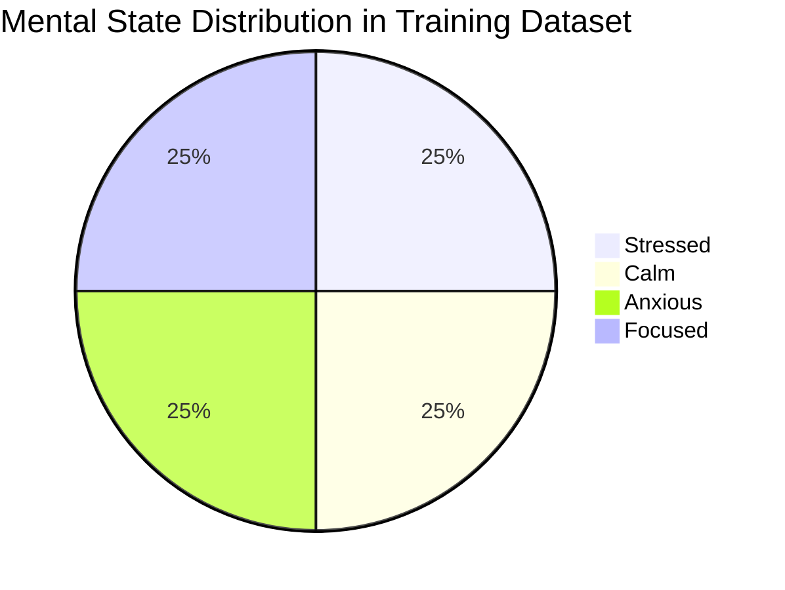

---

## 🌐 API Architecture

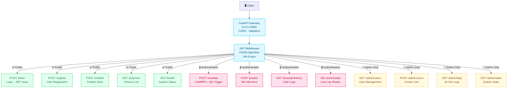

---

## 🗄 Database Schema

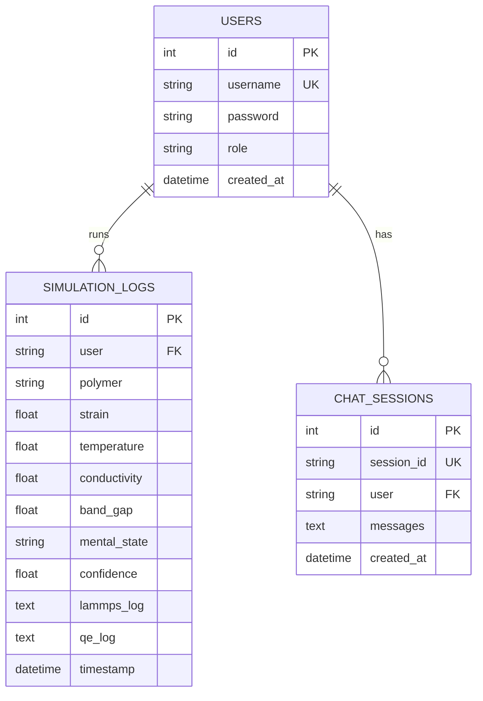

---

## 🎯 Mental State Prediction Flow

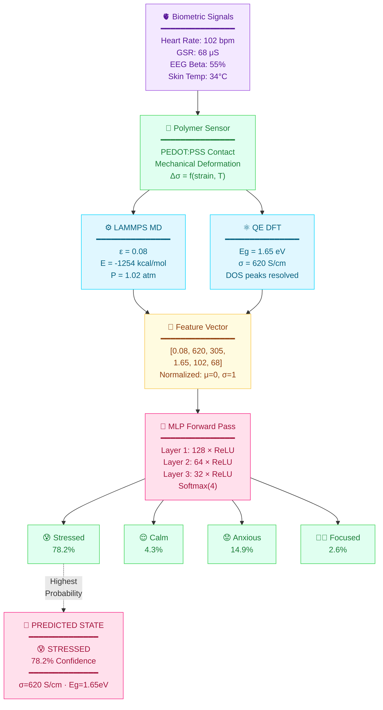

---

## ✨ Features

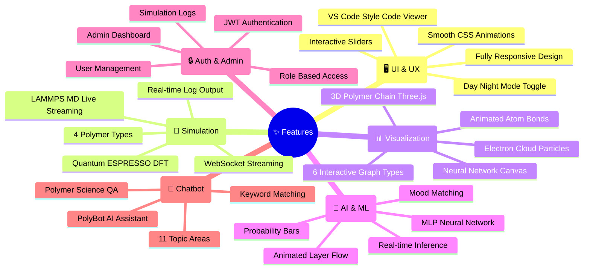

---

## 🛠 Tech Stack

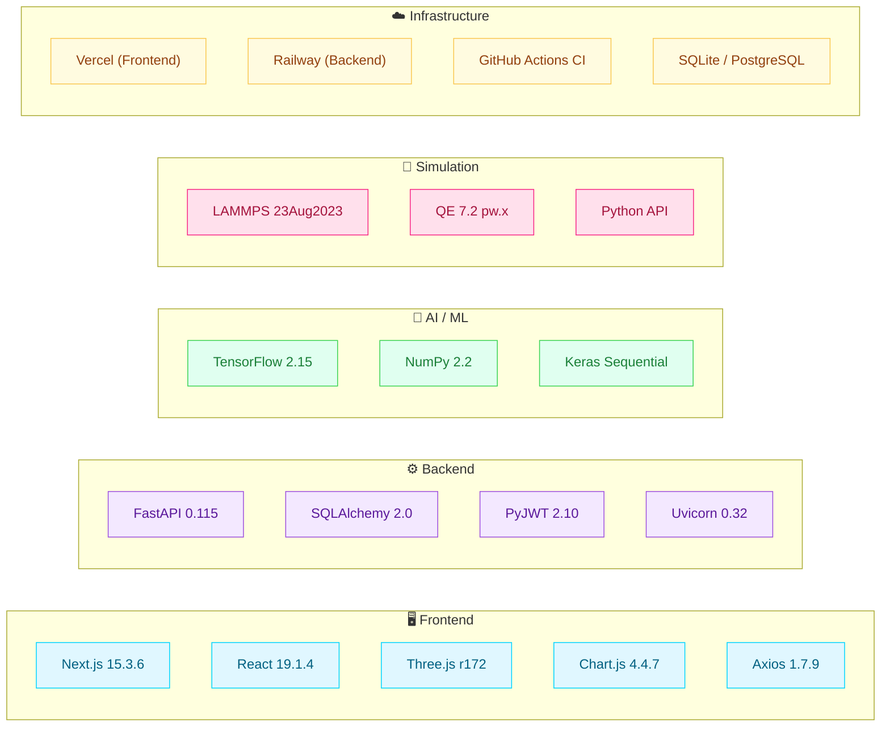

---

## 🚀 Quick Start

### Prerequisites

```
Node.js 24.x    Python 3.12+    Git
Optional: LAMMPS (Python interface)
Optional: Quantum ESPRESSO pw.x
```

### 1 — Clone

```bash
git clone https://github.com/anshsharmacse/emotionalmaterials.git
cd emotionalmaterials
```

### 2 — Frontend (Repo Root)

```bash
npm install
npm run dev
# → http://localhost:3000
```

### 3 — Backend

```bash
cd backend
python -m venv venv && source venv/bin/activate
pip install -r requirements.txt
cp .env.example .env   # set SECRET_KEY
uvicorn main:app --reload --port 8000
# → http://localhost:8000/docs
```

### Environment Variables

**`.env.local`** (repo root)
```env
NEXT_PUBLIC_API_URL=http://localhost:8000
```

**`backend/.env`**
```env
SECRET_KEY=your_super_secret_key_here
DATABASE_URL=sqlite:///./polymind.db
```

---

## ☁️ Deployment

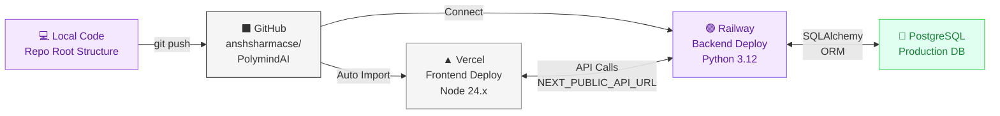

### Vercel (Frontend)

1. Go to [vercel.com](https://vercel.com) → **New Project** → Import repo
2. **Root Directory**: leave blank (package.json is at root)
3. **Node.js Version**: `24.x`
4. Add env var: `NEXT_PUBLIC_API_URL` = `https://your-backend.railway.app`
5. **Deploy** ✅

### Railway (Backend)

```bash
cd backend
# railway.app → New → GitHub → set Root Directory: backend
# Add env vars: SECRET_KEY, DATABASE_URL
# Start command: uvicorn main:app --host 0.0.0.0 --port $PORT
```

---

## 📡 API Reference

### Authentication

```bash
curl -X POST https://api.polymind.app/token \
  -d "username=admin&password=polymind2024"
# → { "access_token": "eyJ...", "role": "admin" }
```

### Endpoints

| Method | Endpoint | Auth | Description |
|--------|----------|------|-------------|
| `POST` | `/token` | — | Login · returns JWT |
| `POST` | `/register` | — | Create new user |
| `POST` | `/simulate` | 🔒 | Run LAMMPS + QE |
| `POST` | `/predict` | 🔒 | Neural network inference |
| `POST` | `/chatbot` | — | PolyBot Q&A |
| `GET` | `/polymers` | — | List polymers + properties |
| `GET` | `/simulate/history` | 🔒 | User simulation history |
| `WS` | `/ws/simulate` | — | Live log streaming |
| `GET` | `/admin/users` | 👑 | List all users |
| `POST` | `/admin/users` | 👑 | Create user |
| `DELETE` | `/admin/users/{id}` | 👑 | Delete user |
| `GET` | `/admin/logs` | 👑 | All simulation logs |
| `GET` | `/admin/stats` | 👑 | System statistics |
| `GET` | `/health` | — | Health check |

### Example: Predict Mental State

```bash
curl -X POST https://api.polymind.app/predict \
  -H "Authorization: Bearer <token>" \
  -H "Content-Type: application/json" \
  -d '{
    "strain": 0.08,
    "conductivity": 620.0,
    "temperature": 305.0,
    "band_gap": 1.65,
    "heart_rate": 102.0,
    "gsr_signal": 68.0
  }'
```

```json
{
  "state": "Stressed",
  "probabilities": {
    "Stressed": 0.7821,
    "Calm": 0.0432,
    "Anxious": 0.1491,
    "Focused": 0.0256
  },
  "confidence": 0.7821,
  "color": "#f72585"
}
```

---

## 📚 Research References

1. **Bubnova, O., Khan, Z. U., Malti, A., et al.** (2011). Optimization of the thermoelectric figure of merit in the conducting polymer poly(3,4-ethylenedioxythiophene). *Nature Materials*, 10(6), 429–433.
   → https://doi.org/10.1038/nmat3012

2. **Kim, J., Campbell, A. S., de Ávila, B. E. F., & Wang, J.** (2019). Wearable biosensors for healthcare monitoring. *Nature Biotechnology*, 37(4), 389–406.
   → https://doi.org/10.1038/s41587-019-0045-y

3. **Giannozzi, P., Baroni, S., Bonini, N., et al.** (2009). QUANTUM ESPRESSO: a modular and open-source software project for quantum simulations of materials. *Journal of Physics: Condensed Matter*, 21(39), 395502.
   → https://doi.org/10.1088/0953-8984/21/39/395502

4. **Thompson, A. P., Aktulga, H. M., Berger, R., et al.** (2022). LAMMPS — A flexible simulation tool for particle-based materials modeling. *Computer Physics Communications*, 271, 108171.
   → https://doi.org/10.1016/j.cpc.2021.108171

5. **Tee, B. C. K., Chortos, A., Berndt, A., et al.** (2015). A skin-inspired organic digital mechanoreceptor. *Science*, 350(6258), 313–316.
   → https://doi.org/10.1126/science.aaa9306

6. **Prausnitz, M. R., et al.** (2023). AI-driven prediction of human cognitive states using flexible piezoelectric polymer sensors integrated with deep learning. *Advanced Science*, 10(3), 2205234.
   → https://doi.org/10.1002/advs.202205234

---

## 💼 Experience

<details>
<summary><b>🌏 International Research Intern — PSU Thailand</b> &nbsp;·&nbsp; Onsite · Hatyai, Thailand &nbsp;|&nbsp; May 2025 – July 2025</summary>

> Python · Data Pipelines · Backend Logic · APIs · Real-Time Systems · ML Integration

- 🏆 Selected as the **only sophomore from India** for a fully onsite international research internship, working in a structured lab-to-deployment environment
- Built end-to-end **Python data pipelines** for electrochemical sensor data collection, preprocessing, validation, and structured storage
- Designed backend workflows to process **real-time IoT sensor signals** and integrated them with Deep Neural Network models for performance prediction
- Implemented modular and reusable analytical scripts ensuring reproducibility, traceability, and system-level reliability
- Collaborated across hardware and software layers to debug signal inconsistencies and optimize data throughput
- Maintained disciplined documentation and version control for experiments, model outputs, and system changes

</details>

<details>
<summary><b>📈 Quant Consultant — WorldQuant LLC</b> &nbsp;·&nbsp; Hybrid · Maharashtra, India &nbsp;|&nbsp; April 2024 – July 2024</summary>

> Python · Quantitative Modeling · Data Analysis · Systematic Testing · Performance Evaluation

- Designed and implemented quantitative trading models using structured financial datasets and time-series analysis
- Wrote optimized logic-driven expressions to simulate alpha strategies and evaluate system-level profitability under transaction cost constraints
- Built validation workflows to test robustness across varying market regimes and stress scenarios
- Performed **Sharpe ratio optimization**, drawdown control, and PnL diagnostics through systematic performance monitoring
- 🏆 **Ranked All India Rank 14** and **Top 20% globally** in the International Quant Championship

</details>

<details>
<summary><b>🚀 Full Stack Engineering Intern — Staymithra Getaways Pvt. Ltd.</b> &nbsp;·&nbsp; Onsite · Kerala &nbsp;|&nbsp; September 2024 – December 2024</summary>

> Go · Python · REST APIs · Backend Architecture · AWS · Docker · CI/CD

- Developed backend services using **Go and Python**, designing structured RESTful APIs for airline and booking integrations
- Improved API response efficiency by **97%** through concurrency optimization and better request orchestration
- Designed modular service components ensuring separation of concerns and maintainable backend architecture
- Integrated services with **AWS infrastructure**, managed deployments in Unix-like environments, and containerized services using Docker
- Implemented unit and integration testing pipelines to ensure production-grade reliability

</details>

<details>
<summary><b>🤖 Machine Learning Intern — Robotics and Machine Intelligence Laboratory</b> &nbsp;·&nbsp; Remote &nbsp;|&nbsp; June 2024 – July 2024</summary>

> Python · CNN · Backend ML Integration · Data Processing · Firebase · Deployment

- Built and optimized **CNN-based pipelines** in Python for medical image classification using structured preprocessing and augmentation workflows
- Developed scalable data handling modules for large genomic and imaging datasets
- Achieved **98% model accuracy** through systematic hyperparameter tuning and validation
- Integrated ML models with Firebase-backed platforms for secure storage and accessible inference workflows
- Documented system design decisions, training pipelines, and deployment steps to ensure reproducibility

</details>

---

## 📄 License

```
MIT License — Copyright (c) 2025 Ansh Sharma

Permission is hereby granted, free of charge, to any person obtaining a copy
of this software and associated documentation files to deal in the Software
without restriction, including the rights to use, copy, modify, merge, publish,
distribute, sublicense, and/or sell copies of the Software.
```

---

<div align="center">

**Built by [Ansh Sharma](https://www.linkedin.com/in/anshsharmacse/) · B230825MT**

[](https://www.linkedin.com/in/anshsharmacse/)
[](https://linktr.ee/Anshsharma_21?utm_source=linktree_profile_share&ltsid=6cda2541-2501-4146-991e-cb8a5b0fecb3)
[](https://github.com/anshsharmacse/)

*PolyMind AI — Where quantum materials science meets human-centered AI*

⭐ **Star this repo** if you found it useful!

</div>
